# The Broken Promise Tax
### What does a late delivery really cost a marketplace?

**Sabarish G** · MSc Business Analytics · SQL · Python · Causal Inference · Machine Learning

[📓 Full notebook](./The_Broken_Promise_Tax.ipynb) · [🌐 HTML report](./The_Broken_Promise_Tax.html) · [📊 Every number, audited](./outputs/key_metrics.json)

---

## The question that started this

Late deliveries are assumed to be bad for business. Every marketplace tries to reduce them. But almost nobody asks the more useful question: **bad how, exactly, and how much?**

Is a customer angrier at *slowness*, or at a *broken promise*? Does one bad delivery lose you a customer forever, or just a review? And if you only have budget to fix one thing, what should it be?

I set out to answer this properly, the way I'd want to if this were a real business problem on my desk: build a clean data model, form a hypothesis, try to break it, and only then write a recommendation. This is that project, using 96,203 real orders from [Olist](https://www.kaggle.com/datasets/olistbr/brazilian-ecommerce), a Brazilian e-commerce marketplace, from a public Kaggle dataset (2017–2018, CC BY-NC-SA 4.0).

---

## Chapter 1 · Building a warehouse I could trust

Before touching a single chart, I built a proper SQL data model: raw CSVs → staging → a star schema of fact and dimension tables, the same pattern I'd use with dbt on a real warehouse.

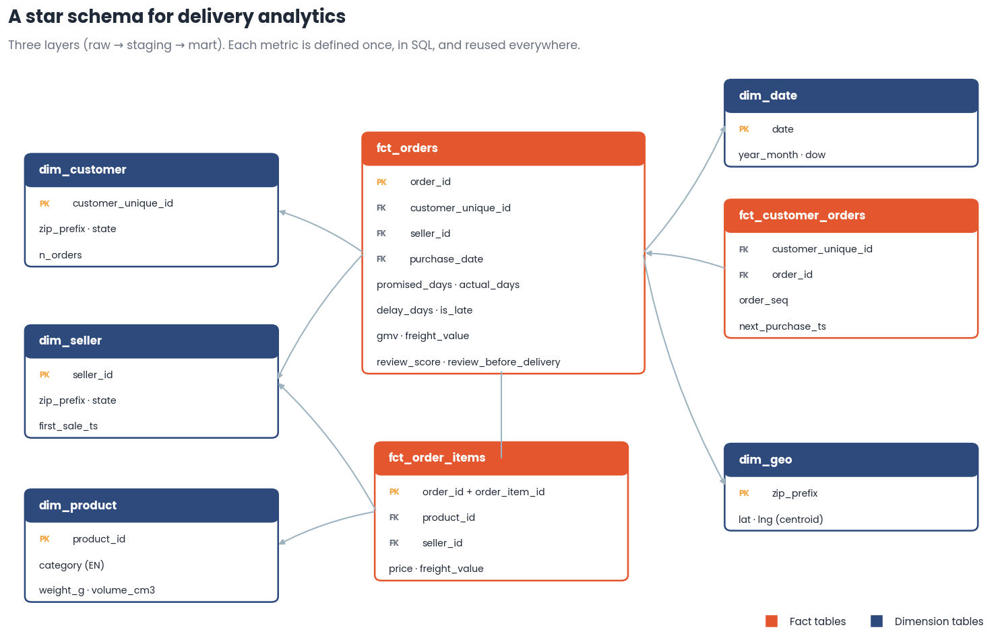

Then I stress-tested it. 24 data-quality tests, split into two tiers: **blocking** tests that must return zero violations (uniqueness, referential integrity, valid ranges), and **warning** tests that flag known quirks in the source data. Nothing gets silently dropped — every quirk gets a documented handling rule.

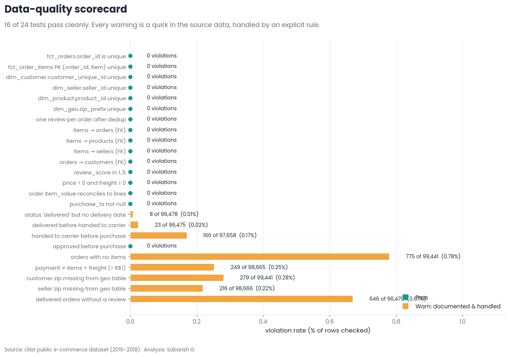

15 of 15 blocking tests passed. 9 warnings, all documented, all handled. Only then did I start asking questions.

---

## Chapter 2 · A strange first observation

The marketplace looked healthy on the surface: 96,203 delivered orders, R$15.8M in GMV, 95,774 customers, 3,060 sellers.

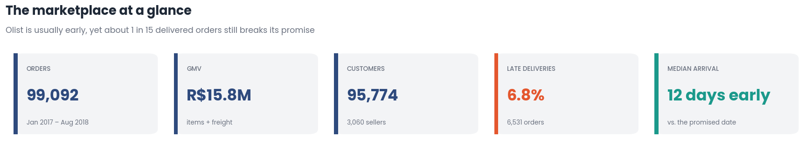

But one number didn't fit. **The typical order arrived 12 days early** — Olist promises about 24 days and actually delivers in about 10. And yet, **6.8% of orders still arrived late.**

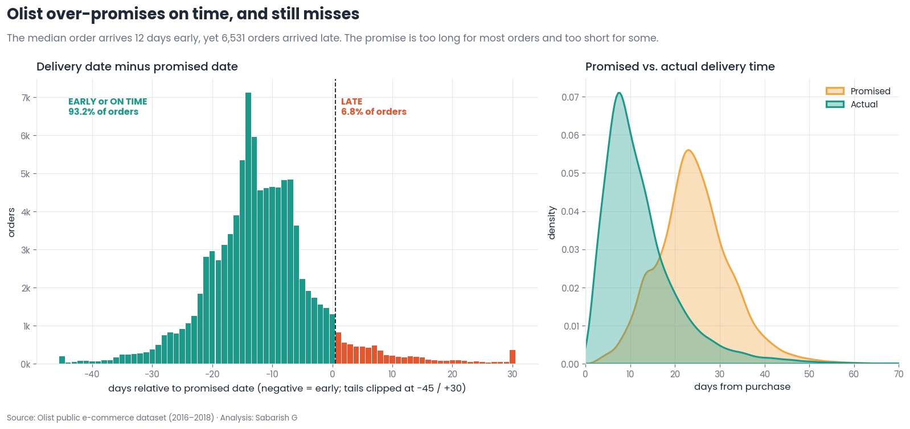

That's the puzzle. A company that pads its promises this generously should almost never miss. So why does it still miss on 1 in 15 orders — and does it miss everywhere equally?

It doesn't. Late rates range from 2.8% in Amazonas to 21.5% in Alagoas. The problem isn't uniform — it's geographic.

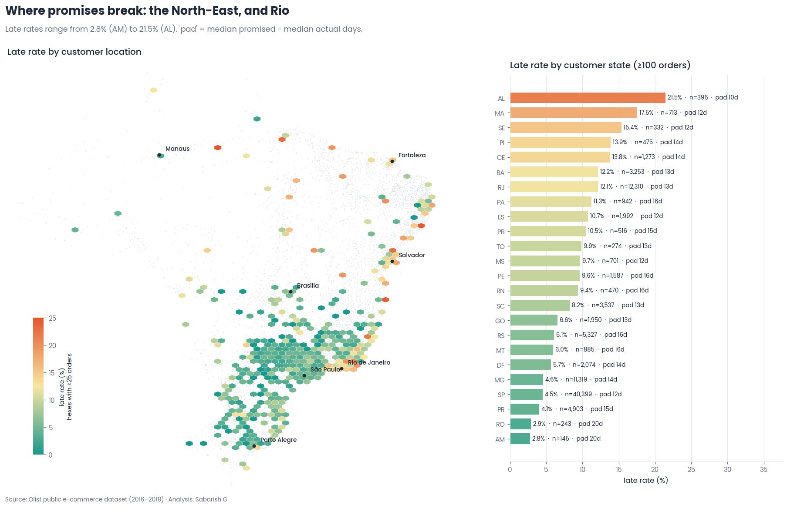

---

## Chapter 3 · The moment a promise breaks

This is the heart of the project. I wanted to know exactly what happens to a customer's rating the instant a delivery crosses from "on time" to "late."

My hypothesis going in: a *cliff*. A sharp drop right at the promised date, because that's the moment a promise is broken.

I was wrong.

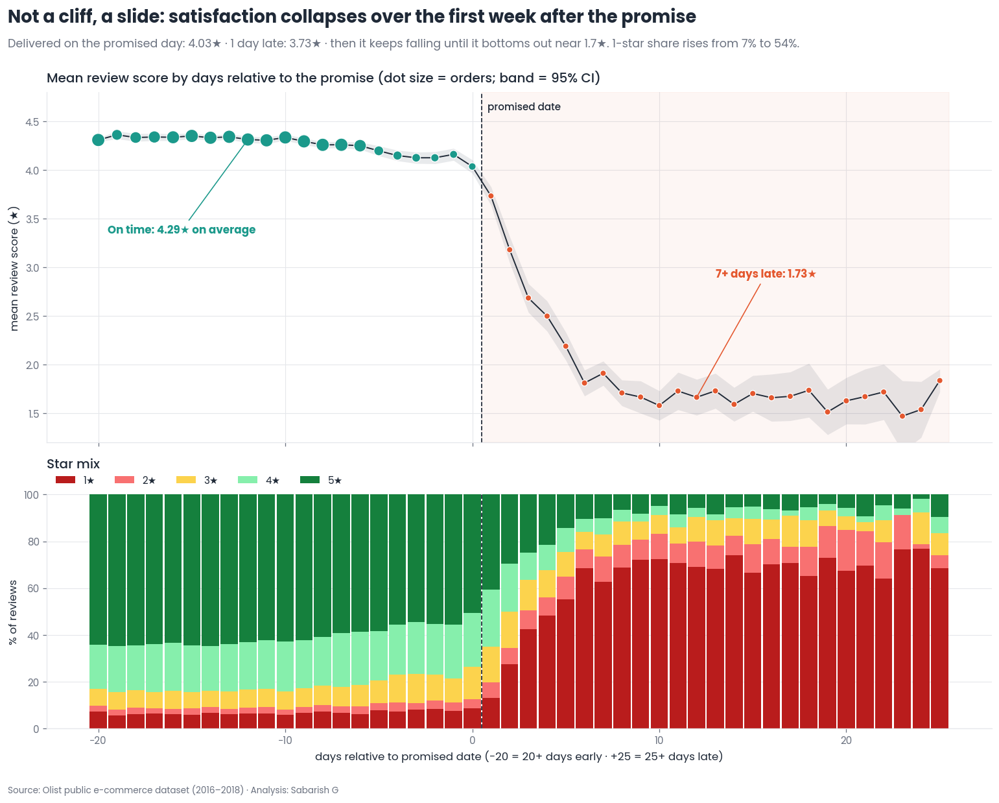

There's no cliff. There's a **slide**. Ratings stay flat around 4.3★ while an order is on time, dip slightly to 4.03★ if it arrives on the exact promised day, then bleed out — losing roughly **0.48★ for every additional day late** — until they bottom out near 1.7★ at a week overdue.

I didn't trust this from a single chart, so I ran a proper **regression discontinuity design**: comparing orders delivered one day before the promise to orders delivered one day after, since these orders are otherwise nearly identical. I tested it across six bandwidths, ran placebo cutoffs where nothing should happen, checked whether orders were suspiciously bunching around the deadline, and tested whether pre-delivery order characteristics (price, weight, distance) jumped at the cutoff the way they shouldn't.

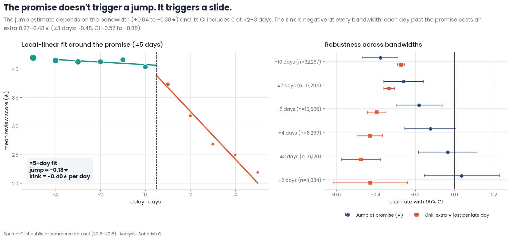

The result held: no significant jump at the promise (−0.03★, 95% CI −0.18 to +0.11), but a real, steep kink of **−0.48★ per day** (CI −0.57 to −0.38) once the promise is broken. This is the difference between a good analyst and a good data scientist — not just finding the pattern, but trying to prove yourself wrong first.

---

## Chapter 4 · Why does it slide instead of jump?

A slide, not a cliff, is a strange shape for a "broken promise" to take. So I went looking for a mechanism, and I found it in the review timestamps.

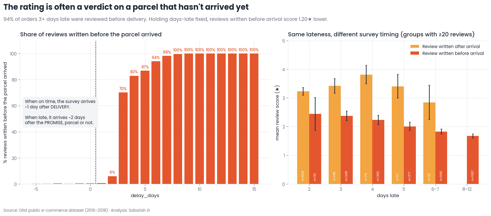

**94% of orders that were 3+ days late were reviewed *before the parcel arrived*.** Olist's satisfaction survey fires based on the *promised* date, not the actual delivery date. Customers are being asked to rate a package while they're still waiting for it — and the longer they wait, the angrier the review, days before the courier even shows up.

I confirmed this wasn't just a hunch by mining the review text itself:

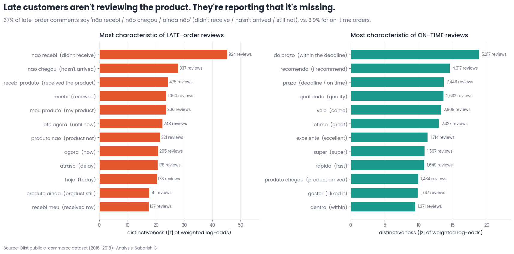

Late-order reviews aren't complaints about product quality. They're status updates. The single most distinctive phrase is *"não recebi"* — **"I didn't receive it."** 37% of late-order comments say some version of this, versus 3.9% for on-time orders. Customers aren't reviewing a product. They're reporting a missing package.

---

## Chapter 5 · Proving the cost, five different ways

A correlation between "late" and "low rating" is easy. A *causal* number is hard, because late orders aren't random — they skew toward certain sellers, routes, and busy months that could depress ratings on their own.

So I estimated the effect five separate ways: a naive difference, OLS with fixed effects, OLS with **seller fixed effects** (comparing late vs. on-time orders *from the same seller*), propensity-score matching, and a cross-fitted doubly-robust estimator. If they didn't agree, I wouldn't trust any of them.

They agreed. Lateness itself — not the seller, not the route, not the season — costs about **−1.98★ per order** (doubly-robust ATT, 95% CI −2.03 to −1.94), and raises the odds of a 1-star review by **47 percentage points**.

I also checked how the damage accumulates day by day, within the same seller:

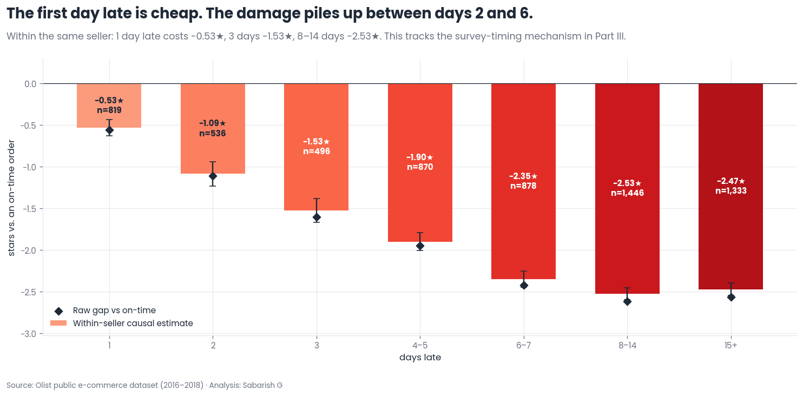

The first day late is nearly free (−0.53★). The real damage happens between days 2 and 6, exactly the window where the survey-timing mechanism from Chapter 4 kicks in.

Then I checked whether this damage was even worse for some products, regions, or sellers — and built a segment-level model (a T-learner with doubly-robust confidence intervals) to find out.

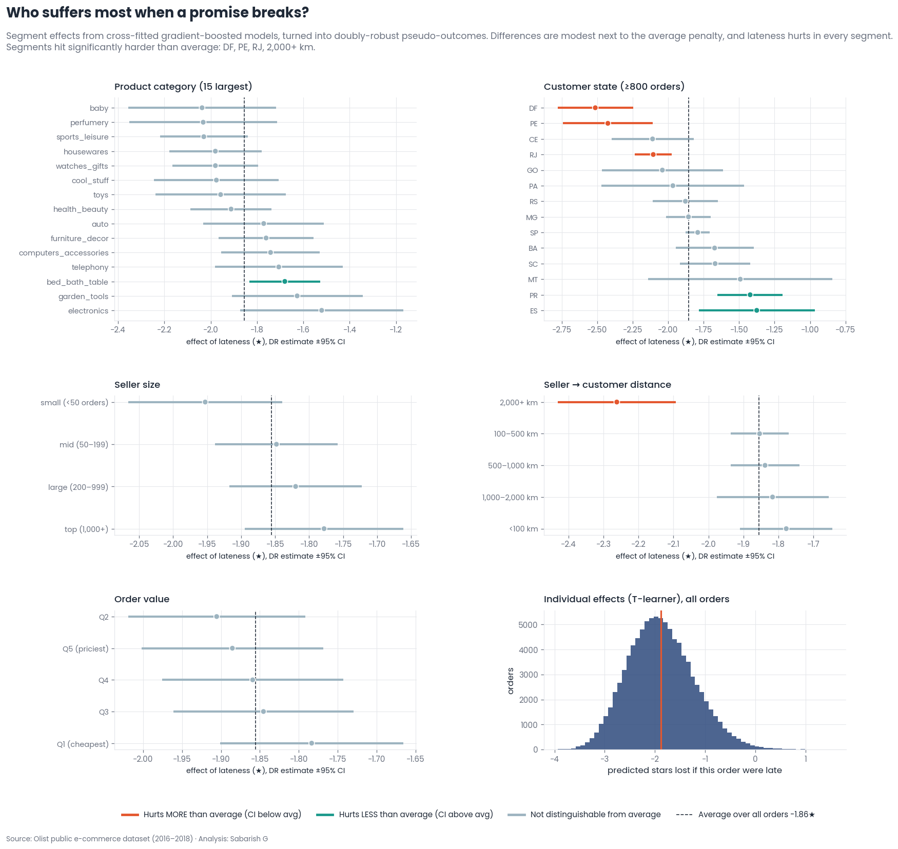

The honest answer: not by much. Lateness hurts almost everywhere, with only a few segments (long-distance orders, a handful of states) significantly worse than average. This mattered — it meant the fix needed to be broad, not targeted at one "problem category."

---

## Chapter 6 · The honest result I almost buried

Here's the part most portfolios skip: **the finding that didn't support the story I wanted to tell.**

I expected a late first order would also cost future repeat business. The raw numbers looked that way: 1.86% of customers reordered within 180 days after an on-time first order, versus 1.35% after a late one.

But once I adjusted for the same confounders as before, the effect shrank to −0.28 percentage points, with a 95% confidence interval of **−0.76 to +0.19 — which includes zero.** I can't claim a real effect here. Combined with the fact that only 3% of Olist's customers ever reorder at all, the repeat-revenue channel just isn't where the money is. I reported this plainly instead of forcing a bigger number.

**The real cost of lateness is reputational, not transactional:** roughly 11,400 stars and 2,700 extra 1-star reviews lost per year — a floor, since it doesn't even count how those reviews affect *other* customers' decisions.

---

## Chapter 7 · Where does lateness actually live?

Before recommending a fix, I checked one more thing: is lateness a *seller* problem, or a *route* problem? This determines whether you punish sellers or fix logistics.

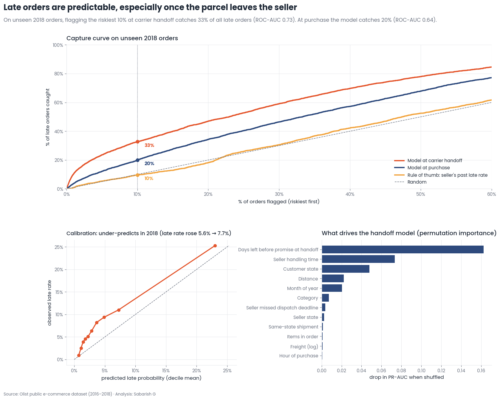

I trained a model on 2017 orders and tested it on unseen 2018 orders — the same setup a live system would face. A seller's late rate in one year barely predicts the next year's (r = 0.14). A **route's** late rate does (r = 0.73). Lateness is structural — carriers and geography — not a handful of bad sellers.

That same model, scored live at the moment a parcel leaves the seller, catches **33% of all late orders in just the riskiest 10% flagged** (ROC-AUC 0.73 on unseen data). Late deliveries are predictable early enough to intervene.

---

## Chapter 8 · Can the promise itself be smarter?

Olist's promise is one fixed buffer applied everywhere. I tested whether a **quantile regression** — predicting the actual delivery-time distribution per order — could do better.

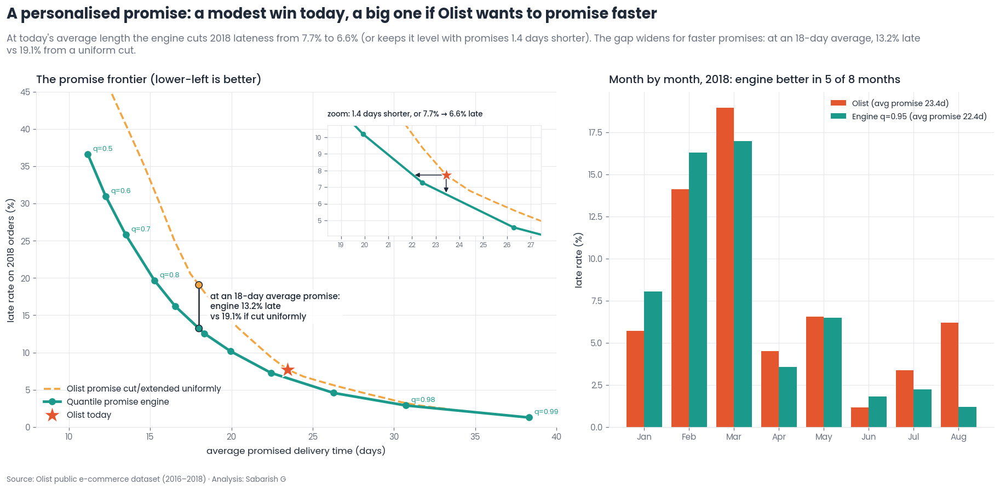

At Olist's current average promise length, a personalised promise engine cuts the late rate from 7.7% to 6.6% on unseen 2018 data. The advantage grows fast if Olist wants to promise *faster*: at an 18-day average promise, the engine holds 13.2% late, versus 19.1% for simply cutting every promise by the same number of days. A smarter promise beats a shorter one.

---

## Chapter 9 · Turning this into a decision

Everything above is analysis. This is the part that matters to a business: **what do you actually do on Monday morning?**

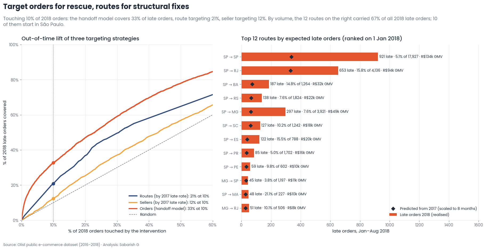

Twelve high-volume, high-late-rate routes — mostly starting in São Paulo — account for **67% of all 2018 late orders.** That's a short, actionable list for a logistics or carrier renegotiation.

I sized three concrete levers in the same unit (stars protected per year), so they're comparable:

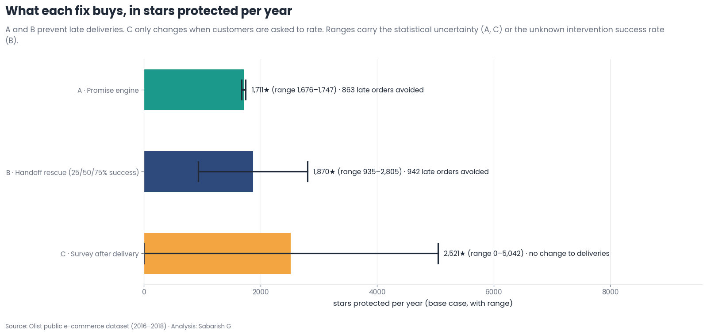

1. **Send the review survey after delivery, not on the promised date** — a config change, not a logistics project, worth up to ~5,000★/year (upper bound).
2. **A handoff rescue queue** that flags the riskiest parcels the moment they leave the seller — ~940 fewer late orders/year at a 50% intervention success rate.
3. **The route-aware promise engine** from Chapter 8 — ~860 fewer late orders/year at today's promise length.

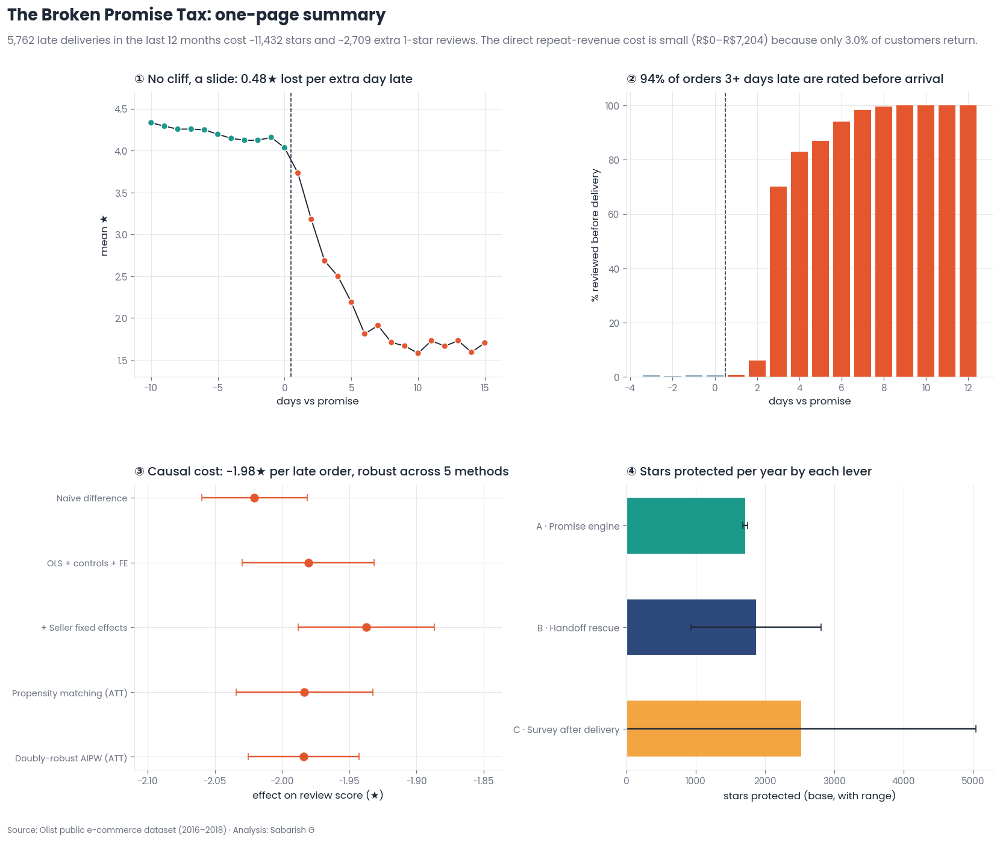

---

## What this project demonstrates

- **SQL data modelling**: raw → staging → star schema, with documented data-quality tests and severity tiers.
- **Causal inference done rigorously**: regression discontinuity with placebo/density/balance checks, seller fixed effects, propensity matching, doubly-robust AIPW — five methods, cross-checked against each other.
- **Honest reporting of a null result**, not just the finding that fit the narrative.
- **Machine learning validated the right way**: out-of-time (not random) splits, calibration checks, permutation importance.
- **Turning statistics into a decision**: every recommendation is sized in the same unit, with a stated range of uncertainty, not a single overconfident number.

Every figure in this README is pulled directly from [`outputs/key_metrics.json`](./outputs/key_metrics.json) — an audit trail generated by the notebook itself, so nothing here is typed in by hand.

---

## Run it yourself

```bash
pip install -r requirements.txt
# download https://www.kaggle.com/datasets/olistbr/brazilian-ecommerce into data/raw/
jupyter notebook The_Broken_Promise_Tax.ipynb   # full run: ~2 minutes
```

```
├── The_Broken_Promise_Tax.ipynb   ← the full analysis, executed
├── The_Broken_Promise_Tax.html    ← same notebook as a styled web report
├── images/                        ← the 16 charts used in this README
├── sql/                           ← staging, dimension and fact models
├── outputs/                       ← every number behind every chart, audited
└── data/raw/                      ← put the 9 Kaggle CSVs here
```

## Limitations

This is observational data — the causal estimates assume no unmeasured confounding beyond seller, route, product, time and order history, mitigated by five agreeing estimators. The dataset can't show how a rating affects *other* customers' future purchases, so the reputational cost above is a floor, not a ceiling. Lever B's intervention success rate and Lever C's timing-gap upper bound are stated assumptions, not measured facts — they're flagged as such in the notebook.

**Data:** [Olist Brazilian E-Commerce Public Dataset](https://www.kaggle.com/datasets/olistbr/brazilian-ecommerce), CC BY-NC-SA 4.0. No employer data is used anywhere in this project.
